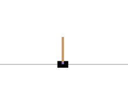

# Robot Learning

Repository containing four assignments developed for the **Robot Learning** course, focused on reinforcement learning for control, policy optimization, and sim-to-real transfer.

The activities cover both **foundational methods** and **advanced reinforcement learning techniques**, starting from classical control on CartPole and progressing towards **tabular RL**, **policy gradient methods**, and a **sim-to-real-inspired project** on the Hopper environment with **domain randomization**.

  
  

## Repository Overview

This repository collects the following course assignments:

1. **Exercise 1 — CartPole, LQR, and Introductory Reinforcement Learning**
2. **Exercise 2 — Tabular Q-Learning**
3. **Exercise 3 — Policy Gradient Methods, PPO, and SAC**
4. **Project — Sim-to-Real Transfer with Domain Randomization on Hopper**

Each folder contains code, experiments, and reports related to the corresponding assignment.

---

## Topics Covered

- Classical control with **LQR**
- Reinforcement learning fundamentals
- Random vs learned policies
- Hyperparameter tuning in RL
- **Tabular Q-Learning**
- Exploration strategies: fixed epsilon vs **GLIE**
- Value function visualization
- **REINFORCE** with and without baseline
- **PPO** and **SAC** with Stable-Baselines3
- Continuous action spaces
- Sim-to-real transfer challenges
- **Uniform Domain Randomization (UDR)**
- Robust policy learning in MuJoCo environments

---

## Exercises Summary

### Exercise 1 — CartPole, LQR, and Introductory RL

The first assignment introduces the **CartPole** environment and compares a **model-based controller** with a **reinforcement learning agent**.

Main activities:
- analysis of CartPole observations and dynamics
- evaluation of an **LQR baseline**
- study of the effect of the control penalty parameter `R`
- training and testing of a simple RL agent
- comparison with a **random policy**
- tuning of the **learning rate**
- analysis of **repeatability** and stochasticity in RL
- design of **custom reward functions**

Key findings:
- with the LQR controller, all states converge close to zero after approximately **237 timesteps**
- the magnitude of the applied force is **inversely proportional** to the value of `R`
- the best learning rate among the tested values was **1e-2**, achieving the most stable and strongest performance
- a model trained for 200 timesteps could still generalize to **500 timesteps** in testing under suitable hyperparameters
- RL training showed significant **variance across runs**, highlighting the importance of multi-seed evaluation
- custom rewards allowed the agent to learn behaviors beyond simple pole balancing, such as position tracking and lateral movement across the track

---

### Exercise 2 — Tabular Q-Learning

The second assignment focuses on implementing **Q-learning** for CartPole in a **tabular setting**, requiring **state discretization**.

Main activities:
- implementation of tabular **Q-learning**
- comparison between:
  - fixed exploration with `epsilon = 0.2`
  - decaying exploration with **GLIE**
- analysis of training returns over episodes
- computation of the greedy **value function**
- visualization of the value landscape with a **heatmap**
- study of the effect of **Q-value initialization**

Key findings:
- the **GLIE schedule** produced smoother learning and lower variance than constant epsilon
- the heatmap of the value function highlighted that the most favorable regions correspond to central values of **cart velocity** and **pole angle**
- optimistic initialization (`Q = 50`) improved exploration even under a greedy policy (`epsilon = 0`), while zero initialization often led to poor exploration and weaker performance
- Q-learning can be extended to continuous state spaces only through **function approximation**
- standard Q-learning is not directly suitable for **continuous action spaces**, since the maximization over actions becomes intractable

---

### Exercise 3 — Policy Gradient Methods, PPO, and SAC

The third assignment explores **policy gradient methods** on a modified **continuous-action CartPole** environment.

Main activities:
- implementation of **REINFORCE**
- comparison of:
  - REINFORCE without baseline
  - REINFORCE with constant baseline
  - REINFORCE with normalized discounted returns
- discussion of safety and control issues in real-world continuous-action systems
- use of **Stable-Baselines3** to train:
  - **PPO**
  - **SAC**
- comparison between policy gradient and actor-critic methods

Key findings:
- adding a **baseline** significantly improved REINFORCE stability and performance by reducing gradient variance
- observed average test reward:
  - **REINFORCE without baseline:** `34.61`
  - **REINFORCE with baseline:** `171.25`
  - **REINFORCE with normalization:** `92.08`
- **PPO** showed improvement but required more interactions and was more prone to plateauing in suboptimal regimes
- **SAC** was more **sample-efficient**, more stable, and reached stronger performance faster thanks to entropy-regularized exploration
- both PPO and SAC eventually solved the environment with longer training, while SAC achieved much better performance already at intermediate training budgets

---

### Project — Sim-to-Real Transfer on Hopper with Domain Randomization

The final project addresses a simplified **sim-to-real transfer** problem using the **Hopper** environment in MuJoCo.

The idea is to train in a **source domain** and transfer the learned policy to a **target domain** with slightly different dynamics. The gap between domains is introduced by changing the **torso mass**, simulating a reality gap. To improve robustness, **Uniform Domain Randomization (UDR)** is applied to the remaining link masses.

Main activities:
- inspection of the **Hopper** environment
- implementation of a training pipeline with **Stable-Baselines3**
- training and testing on:
  - source → source
  - source → target
  - target → target
- implementation of **UDR**
- analysis of robustness and transfer performance

Environment properties:
- **state space:** continuous, shape `(11,)`
- **action space:** continuous, shape `(3,)`
- source and target differ in the **torso mass**

Key findings:
- performance generally drops when transferring from **source → target**, due to the mismatch in dynamics
- direct training on the target environment gives an **upper bound**, but in real robotics this is often infeasible because it is expensive, unsafe, and data-intensive
- **UDR** improved robustness in most tested configurations and often reduced variance
- domain randomization can mitigate transfer degradation, although it may also produce more conservative policies if the randomization range is poorly chosen

---

## Main Results at a Glance

| Assignment | Main Topic | Main Outcome |
|------------|------------|--------------|
| Exercise 1 | LQR + Intro RL | Best RL learning rate: `1e-2`; LQR states converge near zero after ~237 steps |
| Exercise 2 | Tabular Q-Learning | GLIE outperforms constant epsilon in stability; optimistic Q initialization improves exploration |
| Exercise 3 | Policy Gradients + SB3 | REINFORCE benefits strongly from baseline; SAC outperforms PPO in speed and stability |
| Project | Sim-to-Real + UDR | Domain randomization improves robustness and helps reduce the source-target performance gap |

---

## Technologies Used

- **Python**
- **Gymnasium**
- **NumPy**
- **Matplotlib**
- **PyTorch**
- **Stable-Baselines3**
- **MuJoCo**

---
